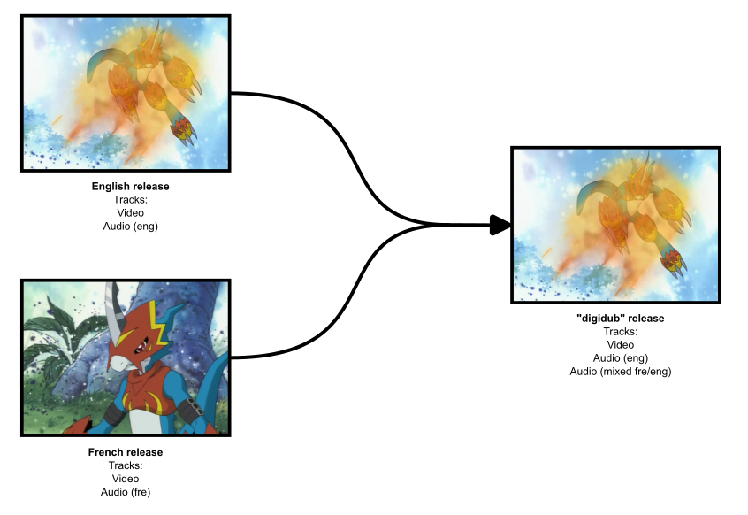
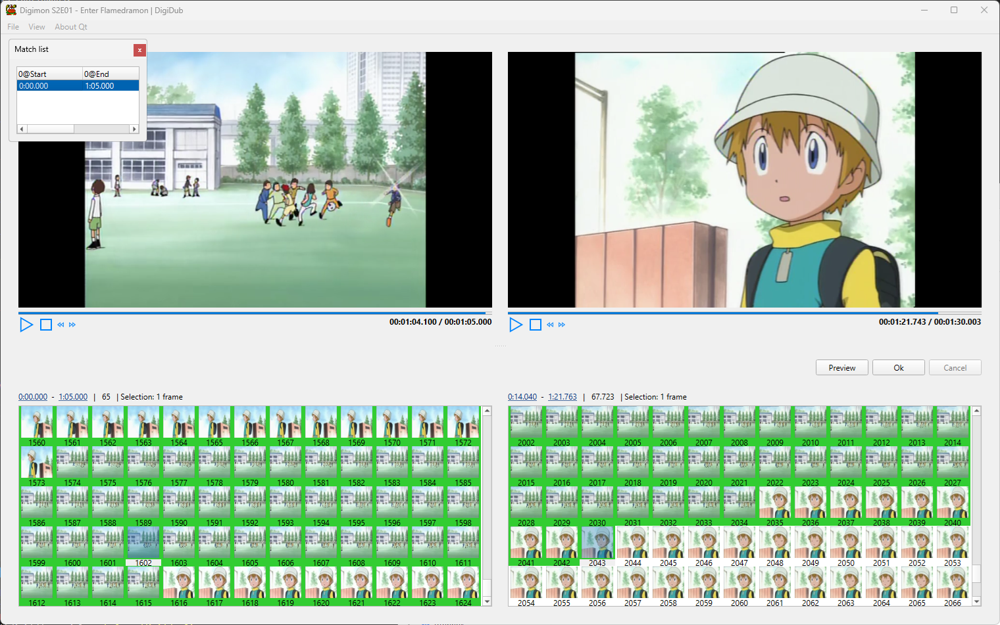

# digidub

This project consists of a set of programs for dubbing a video with audio
from another video.

These programs were written for dubbing episodes of the "Digimon: Digital Monsters Season 1-4" 
DVD boxset with audio from the french release.

The goal is simple:
- take an episode (dubbed in english) from the series
- take the same episode from the french release
- produce a video that uses the "english" video and the french audio

This may sound easy on paper because "this is the same episode", but 
it turned out to be far more challenging than I anticipated; hence the 
creation of these programs.

Different releases have different requirements.
Episodes do not have the same length. Some have scenes added or removed.
Some scenes may be slowed down to achieve a target length.

A basic tutorial, written in French, is available in the `tutoriel` folder.
[Link](tutoriel/README.md)

## Content of this repository

The `tutoriel` folder contains a basic tutorial (in French) on how to use 
the programs.

The `lib` folder contains source code shared by the following programs.

The `cli` folder contains the source code for the command-line tool `digidub-cli`
which can be used to create dubbing projects and perform automatic scene
detection and match search between the two input videos.

The `editor` folder contains the source code for `matcheditor`, a GUI that helps
visualizing and editing the matches detected by `digidub-cli`.

## Requirements

For compiling:
- a compiler supporting C++ 20
- CMake
- Qt 6, with the extra module Qt Multimedia 

For running the program:
- `ffmpeg` and `mkvmerge` must be installed on your system and added to 
  your `PATH`

## Changelog

**v2.1:** display audio waveform + various user experience improvements (e.g., undo/redo).

**v2.0:** added a graphical user interface (GUI).

